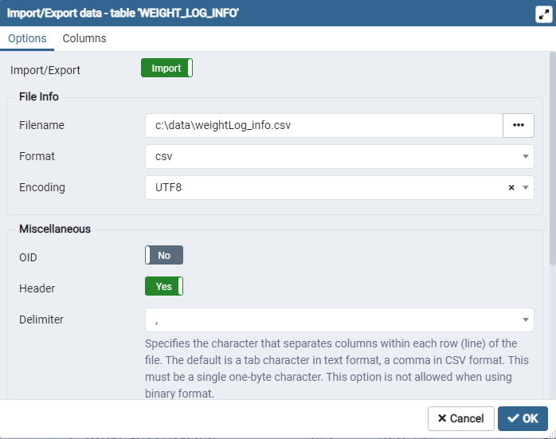

## PostgreSQL Database Setup with Docker 

### Docker Setup

1 - Download and install Docker Desktop. Docker Desktop can be downloaded from [Docker](www.docker.com) 

2 - On Home page of Docker, click on the Postgres latest image

3 - Copy the connection string

### Connect pgAdmin to Docker Postgres Database server


### Import CSV file into database table

#### 1 - Create a new table in your database.  An example create statement is below.

```sql
CREATE TABLE IF NOT EXISTS public."WEIGHT_LOG_INFO"
(
    "ID" bigint,
    "DATE" date,
    "WEIGHT_KG" numeric(8,2),
    "WEIGHT_LBS" numeric(8,2),
    "FAT" character varying COLLATE pg_catalog."default",
    "BMI" numeric(8,2),
    "IS_MANUAL" boolean,
    "LOG_ID" bigint
)

TABLESPACE pg_default;

ALTER TABLE IF EXISTS public."WEIGHT_LOG_INFO"
    OWNER to postgres;
```


#### 2 - In pgAdmin, select Import/Export from the menu. See screen shot below for importing CSV file


