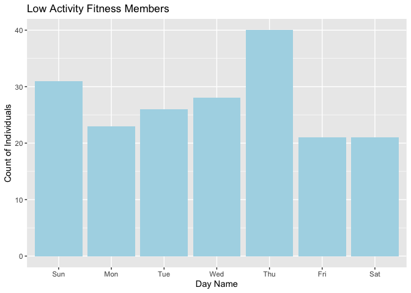
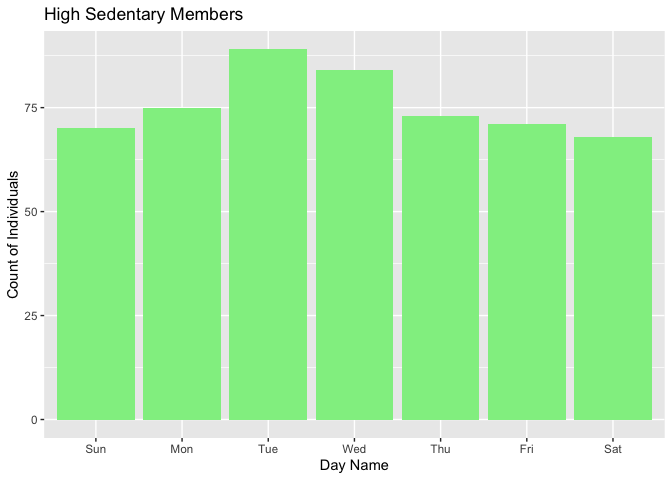
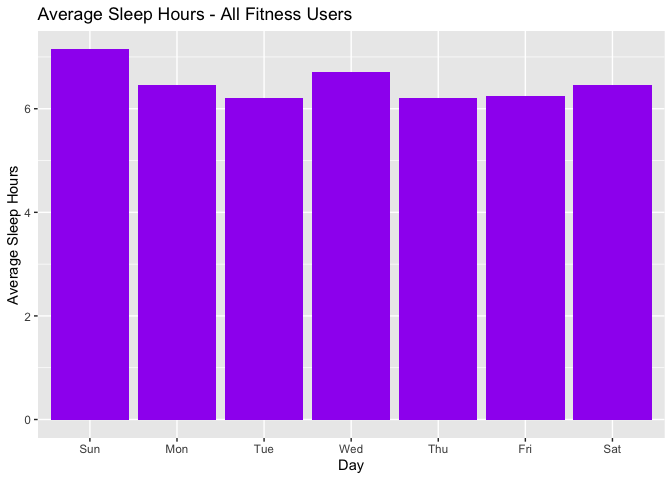
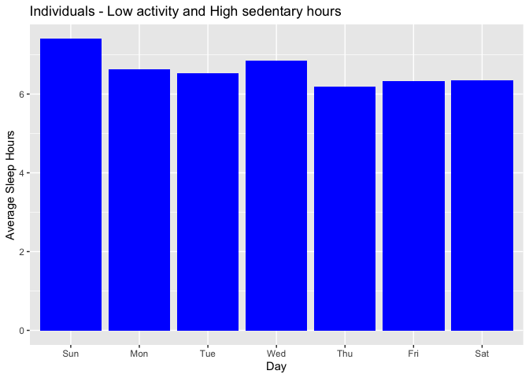

Share Phase
================

Communicate data findings from the Analyze phase through data
visualizations. Each data visualization is part of a larger data story
about the initial questions for the case study.

The Analysis phase discovered two groups of fitness users in which to
target for outreach activities or further analysis. The first group are
individuals who had activity of one or less hours for at least one day.
The second group of fitness members were those who had one or more days
of high sedentary hours.

The data visualizations for both groups of fitness app users will be
shared with stakeholders and recommendations will be made for each group
in the Act phase.

### Low Activity Days

<!-- -->

In the low activity group, Thursday has the highest number of members
with zero or one hour of activity.

### High Sedentary Days

<!-- -->

Tuesday’s and Wednesday’s have the highest number of individuals logging
high sedentary hours.

### Analyze sleep activity

<!-- -->

For all fitness members, the average sleep hours per day is six hours or
higher. All members on average sleep more hours on Sundays and
Wednesdays.

<!-- -->

This chart shows that the group of 24 individuals who logged both low
activity and high sedentary hours sleep on average at least six hours
per day. This is equivalent to the average sleep hours for the entire
group of fitness users.

### Individuals with Low Activity and High Sedentary Hours

|         ID |
|-----------:|
| 1503960366 |
| 1624580081 |
| 1644430081 |
| 1844505072 |
| 1927972279 |
| 2026352035 |
| 2320127002 |
| 4020332650 |
| 4057192912 |
| 4319703577 |
| 4388161847 |
| 4445114986 |
| 4702921684 |
| 5577150313 |
| 6117666160 |
| 6290855005 |
| 6775888955 |
| 7007744171 |
| 7086361926 |
| 8053475328 |
| 8253242879 |
| 8583815059 |
| 8792009665 |
| 8877689391 |
